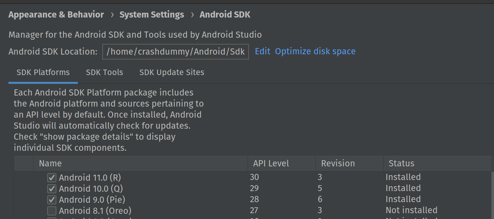
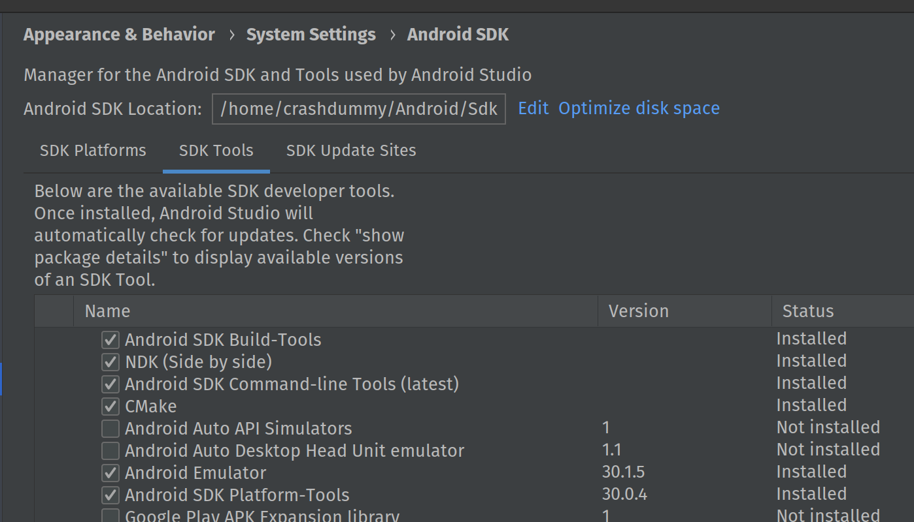

# XamarinRiderDev
Guide on how to develop xamarin apps in rider under linux.

Well this is how I do it. ( Run scripts as sudo )

## dotnet, mono, java8 and build-tools

```bash
echo "------------------------------"
echo " Install .NET Core and Mono SDK: "
echo "------------------------------"
wget -q https://packages.microsoft.com/config/ubuntu/20.04/packages-microsoft-prod.deb -O dotnetRepo.deb
dpkg -i dotnetRepo.deb

apt-key adv --keyserver hkp://keyserver.ubuntu.com:80 --recv-keys 3FA7E0328081BFF6A14DA29AA6A19B38D3D831EF

# Currently installed from preview as msbuild is not in the stables yett
echo "deb https://download.mono-project.com/repo/ubuntu preview-focal main" | tee /etc/apt/sources.list.d/mono-official-preview.list

apt update
apt install mono-complete dotnet-sdk-3.1 -y

# Afterwards set stable as repoSource
rm /etc/apt/sources.list.d/mono-official-preview.list
echo "deb https://download.mono-project.com/repo/ubuntu stable-focal main" | tee /etc/apt/sources.list.d/mono-official-stable.list
apt update
```

```
echo "------------------------------"
echo " Install JDK 8u212 + Xamarin  "
echo "------------------------------"

# Install Java 8 with installScript ( cant load with wget... license thingies )
jdk-8u212-linux-x64.tar.gz

wget https://jenkins.mono-project.com/view/Xamarin.Android/job/xamarin-android-linux/2194/Azure/processDownloadRequest/xamarin-android/xamarin.android-oss_v9.2.99.172_Linux-x86_64_master_d33bbd8e-Debug.tar.bz2
wget https://raw.githubusercontent.com/chrishantha/install-java/master/install-java.sh
chmod +x ./install-java.sh
yes | ./install-java.sh -f jdk-8u212-linux-x64.tar.gz

# Insert latest working xamarin buildChain
tar xjf ./xamarin.android-oss_v9.2.99.172_Linux-x86_64_master_d33bbd8e-Debug.tar.bz2
mkdir "/usr/lib/xamarin.android"
mkdir "/usr/lib/mono/xbuild/Xamarin/"
cp -a "./xamarin.android-oss_v9.2.99.172_Linux-x86_64_master_d33bbd8e-Debug/bin/Debug/lib/xamarin.android/." "/usr/lib/xamarin.android/"
rm -rf "/usr/lib/mono/xbuild/Xamarin/Android"
rm -rf "/usr/lib/mono/xbuild-frameworks/MonoAndroid"
ln -s "/usr/lib/xamarin.android/xbuild/Xamarin/Android/" "/usr/lib/mono/xbuild/Xamarin/Android"
ln -s "/usr/lib/xamarin.android/xbuild-frameworks/MonoAndroid/" "/usr/lib/mono/xbuild-frameworks/MonoAndroid"
ln -s "/usr/lib/x86_64-linux-gnu/libzip.so.5.0" "/usr/lib/x86_64-linux-gnu/libzip.so.4"
```

## Android Studio
Afterwards install [Android Studio](https://developer.android.com/studio/), open it and go to *Configure (bottom) Settings -> System Settings -> Android*

### SDK Platforms:
Install your Target APIs


### SDK Tools
Don't install the latest build-tools.  
The current ApkSigner won't work with java8 and thus xamarin


Install some of the remainings.



## Rider

### Settings
Install [Rider](https://www.jetbrains.com/rider/download/#section=linux), open it and go to *Configure (bottom) Settings -> Build, Execution, Deployment -> Android*

*Use your AndroidHome and correct ndk version!*


### Inside the .csproj
Append the *SupportedAbis* where needed.


```xml
<AndroidSupportedAbis>arm64-v8a;armeabi-v7a;x86;x86_64</AndroidSupportedAbis>
```

```xml
    <PropertyGroup Condition=" '$(Configuration)|$(Platform)' == 'Debug|AnyCPU' ">
        <DebugSymbols>True</DebugSymbols>
        <DebugType>portable</DebugType>
        <Optimize>False</Optimize>
        <OutputPath>bin\Debug\</OutputPath>
        <DefineConstants>DEBUG;TRACE</DefineConstants>
        <ErrorReport>prompt</ErrorReport>
        <WarningLevel>4</WarningLevel>
        <AndroidUseSharedRuntime>True</AndroidUseSharedRuntime>
        <AndroidSupportedAbis>arm64-v8a;armeabi-v7a;x86;x86_64</AndroidSupportedAbis>
        <AndroidLinkMode>None</AndroidLinkMode>
        <EmbedAssembliesIntoApk>False</EmbedAssembliesIntoApk>
    </PropertyGroup>
    <PropertyGroup Condition=" '$(Configuration)|$(Platform)' == 'Release|AnyCPU' ">
        <DebugSymbols>True</DebugSymbols>
        <DebugType>pdbonly</DebugType>
        <Optimize>True</Optimize>
        <OutputPath>bin\Release\</OutputPath>
        <DefineConstants>TRACE</DefineConstants>
        <ErrorReport>prompt</ErrorReport>
        <WarningLevel>4</WarningLevel>
        <AndroidManagedSymbols>true</AndroidManagedSymbols>
        <AndroidUseSharedRuntime>False</AndroidUseSharedRuntime>
        <AndroidSupportedAbis>arm64-v8a;armeabi-v7a;x86;x86_64</AndroidSupportedAbis>
        <AndroidLinkMode>SdkOnly</AndroidLinkMode>
        <EmbedAssembliesIntoApk>True</EmbedAssembliesIntoApk>
    </PropertyGroup>
```

## Maybe still some issues
Creating a new project creates ./Resources/values/Strings.xml.  
Rider won't recognize it unless its in lowercase.  

```bash
$ mv ./Resources/values/Strings.xml ./Resources/values/strings.xml
```
